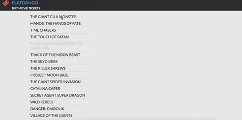

# Flatdango

Flatiron Movie Theater is open for business! You will be building out an application, Flatdango, that allows a user to purchase movie tickets from the theater.

## Demo


## Setup

- Fork and clone this repository.
- Open `index.html` in your browser.
- Run `json-server --watch db.json` to start the backend.

## Endpoints

Your base URL for your API will be: http://localhost:3000

The endpoints you will need are:

- GET `/films/[:id]` (start with `/films/1`)
- PATCH `/films/[:id]`
- GET `/films` (for Advanced Deliverables only)

## Core Deliverables

As a user, I can:

- [x]See the first movie's details, including its **poster, title, runtime, showtime, and available tickets** (the number of tickets left will need to be derived from the theater's capacity and the number of tickets sold)
- Buy a ticket for a movie. The number of tickets sold for that movie should be persisted, and I should be able to see the number of available tickets decreasing on the frontend.
- I should not be able to buy a ticket if the showing is sold out.


###########################################


## Advanced Deliverables:
 

> If you're going to attempt the advanced deliverables, **make sure you have a working commit with all the core deliverables first!**

As a user, I can:

- See a menu of all movies on the left side of the page.
- Click on a movie in the menu to replace the currently displayed movie's details with the new movie's details.
- Buy a ticket for any movie and update the tickets sold for that movie, not just the first.
- Indicate in the menu which movies are sold out.



## Styling

[Semantic Ui](https://semantic-ui.com/elements/list.html) is loaded into this project via a `link` tag in the `head` of the html. Some extra styling is also included in `assets/index.css`. Styling is built in for the base deliverables.

Styling for advanced deliverables:

The listed films should be added to the div with an id of `films`.  Here is sample styling for the film list items:

```html
  <div class="film item">(Title of film)</div>
  <div class="sold-out film item">(Title of a sold-out film)</div>
  <div class="film item">(Title of film)</div>
```

## Rubric

You can find the rubric for this assessment [here](https://github.com/learn-co-curriculum/se-rubrics/blob/master/module-3.md).
